This project is a full-stack web application designed to manage and present detailed information about football matches, teams, players, and statistics. The application uses role-based access control (RBAC), with each role having its own dedicated interface. 

The application is built with a modern architecture using:
Frontend: React
Backend: Spring Boot
Database: PostgreSQL

Key Technologies:
- Spring Boot (REST API)
- Hibernate / JPA (ORM)
- JWT (authentication & authorization)
- BCrypt (password hashing)

The frontend communicates with the backend using:
REST API
HTTP methods
JSON format

Features
USER:
- Change or recover password using email
- Browse the history of matches with details, including: Events, Statistics, Lineups
- View match schedules, predict scores and participate in ranking
- View real-time display of the match minute counter
- View teams, players and coaches detail pages
- View players transfers page
- View league standings and filter matches
- Manage favorite teams, matches, and leagues
- Receive and view notifications
MODERATOR:
- Add, search, edit and delete data, including: Teams, Leagues, Matches, Players, Contracts
- Import data from JSON/CSV files
- Manage match statistics, lineups, events (goals, cards, substitutions)
  ADMIN:
- Create moderator and admin accounts
- Delete user accounts
- Reset user passwords
- Send targeted notifications
- ADMIN2
- test

Screenshots
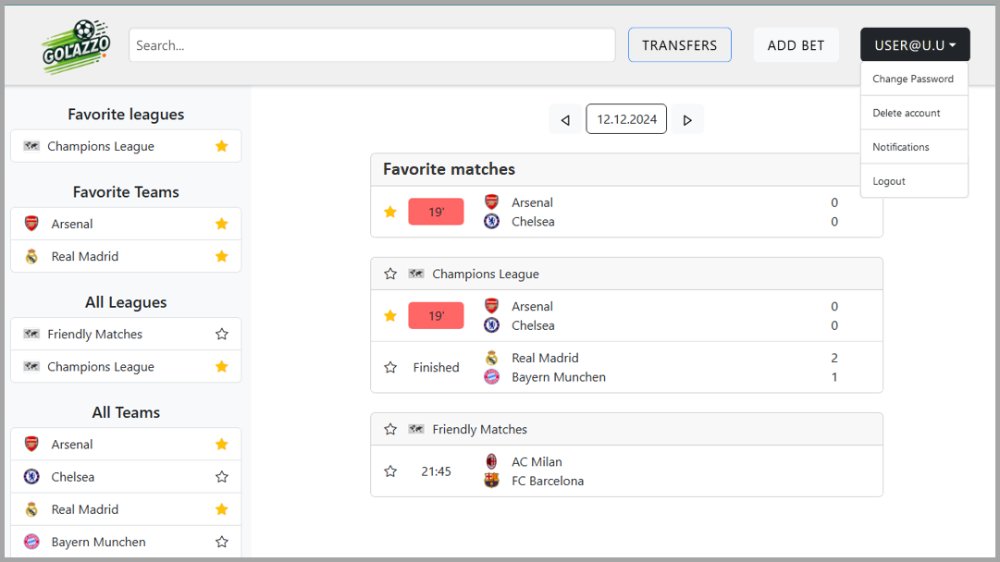
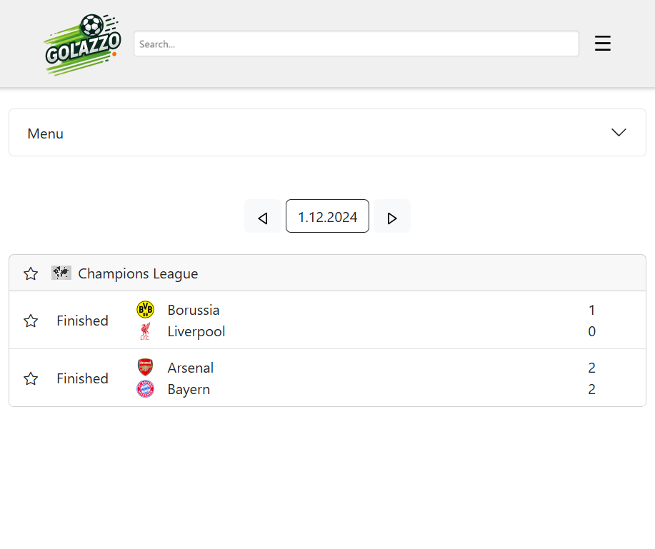
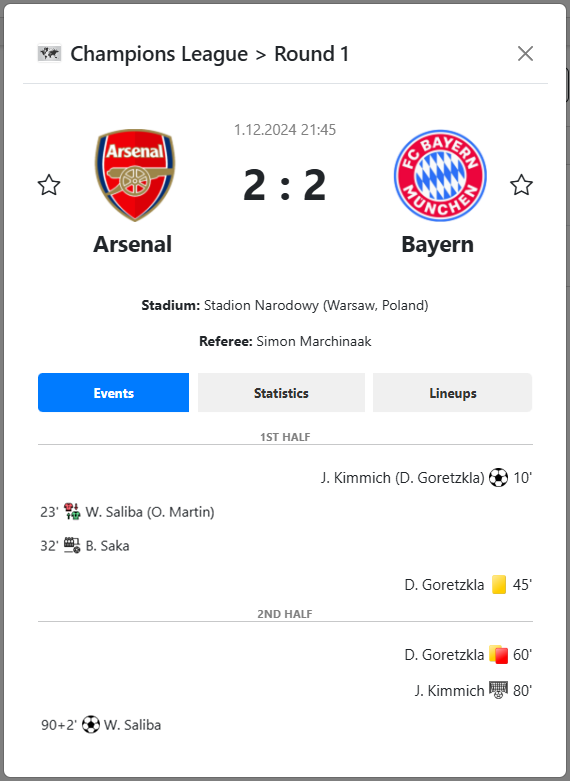
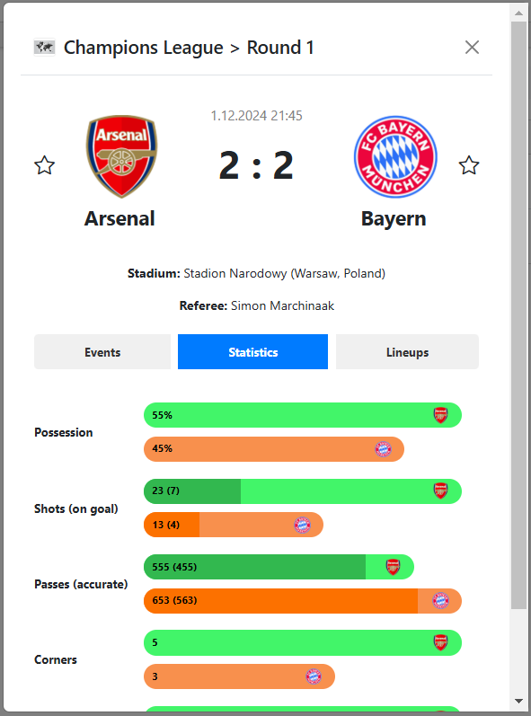
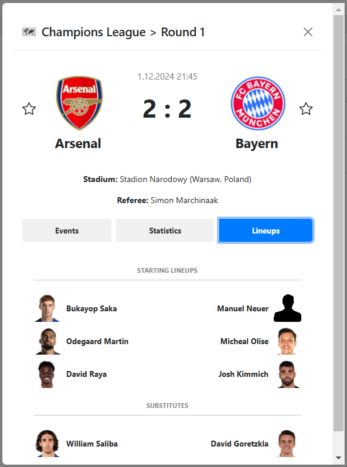
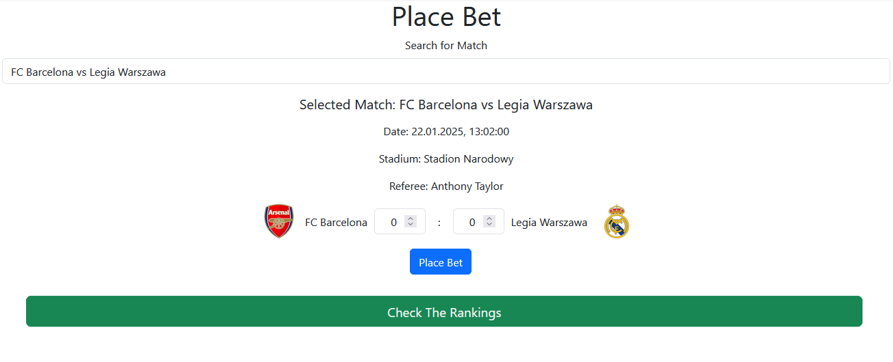
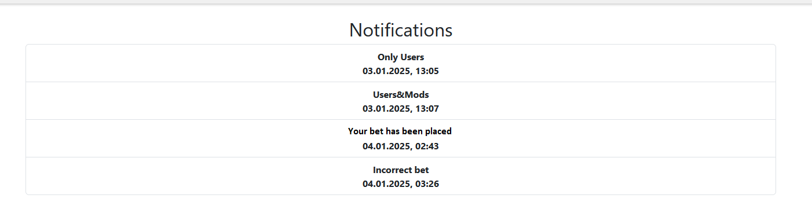
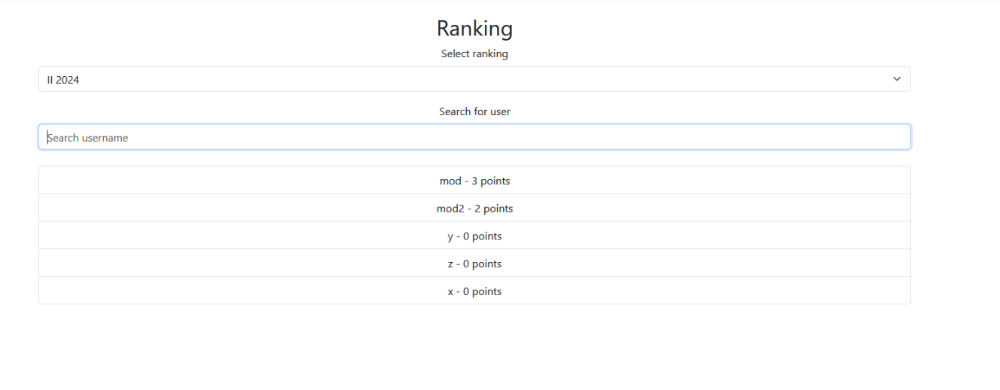
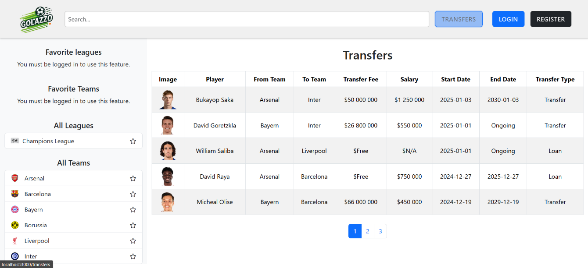
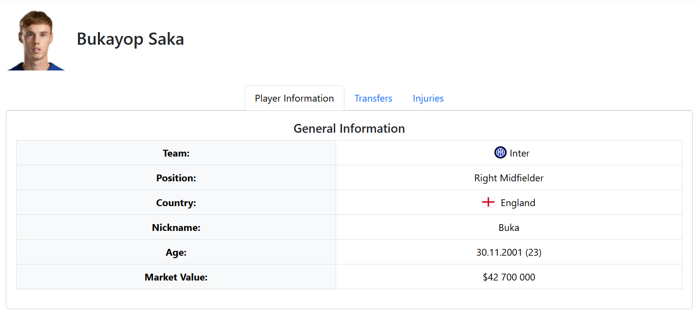
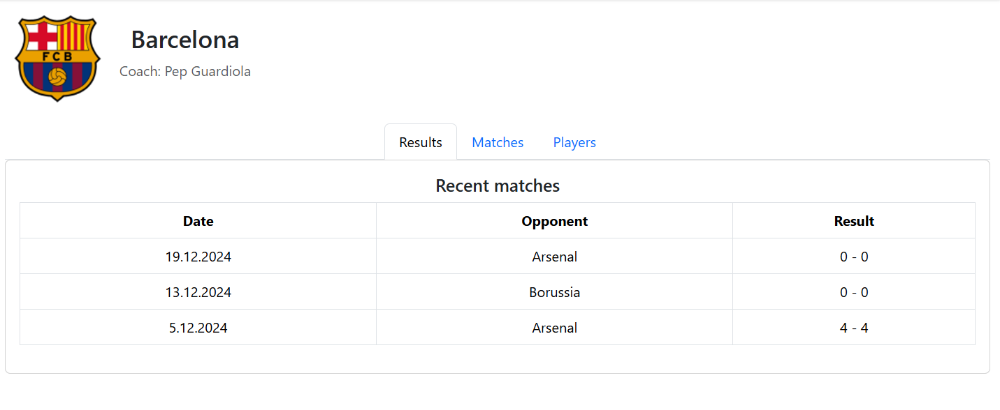
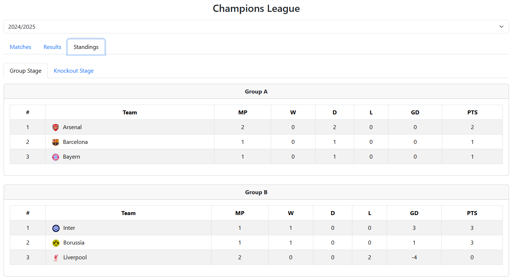
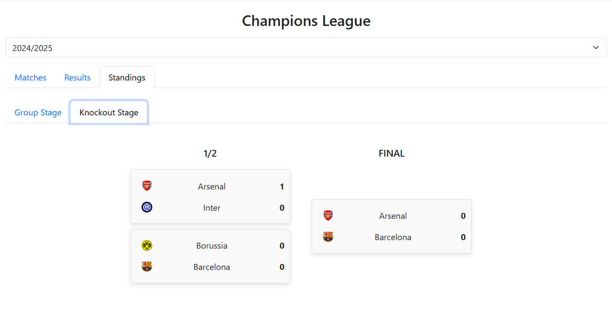
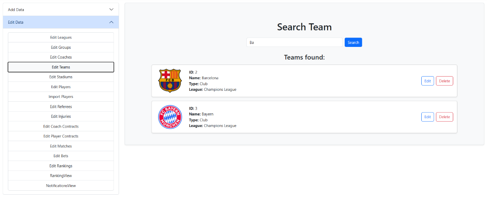
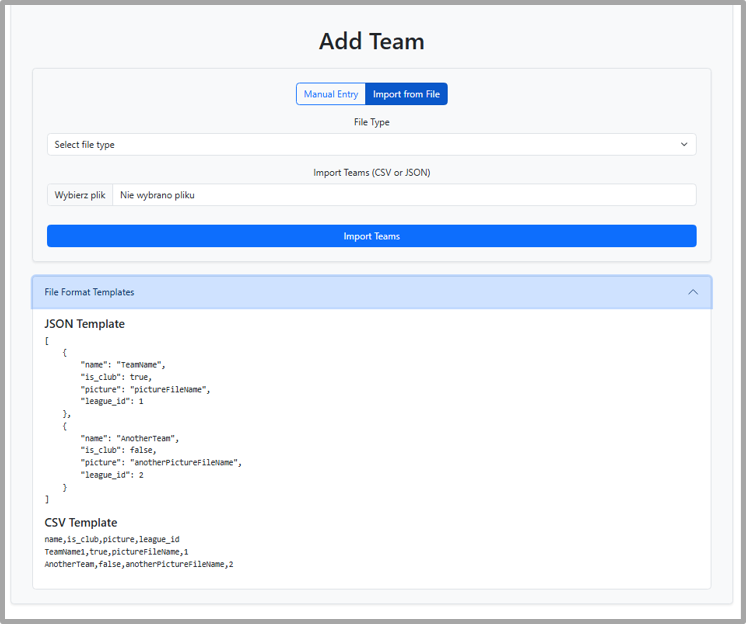
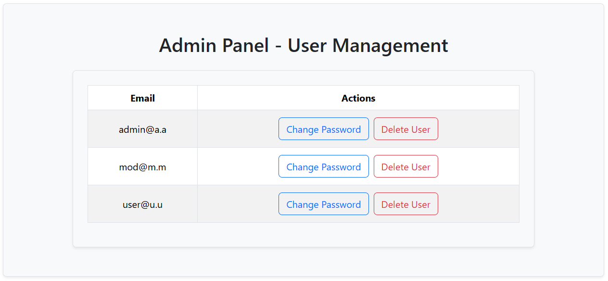

Getting Started
1. Clone the repository:
git clone https://github.com/SzymonKozyra/football-app.git
cd football-app
2. Setup database:
Install PostgreSQL
Create a database
Set password to '123' (or update it in the backend configuration)
3. Run backend:
Open backend project
Run main class (FootballappApplication)
4. Run frontend:
cd frontend
npm install
npm start
5. Access the application:
http://localhost:3000

Important:
The first account created in the system must be an ADMIN
Only ADMIN can create MODERATOR accounts

This project is open for further development and modifications.
- Further system expansion and new features
- UI/UX improvements
- Performance optimization
- Additional security enhancements
